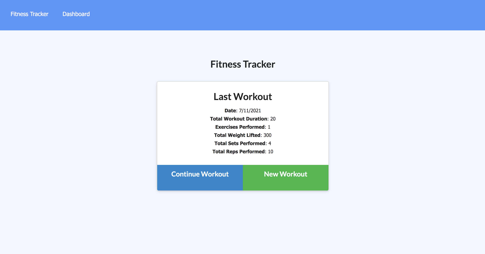
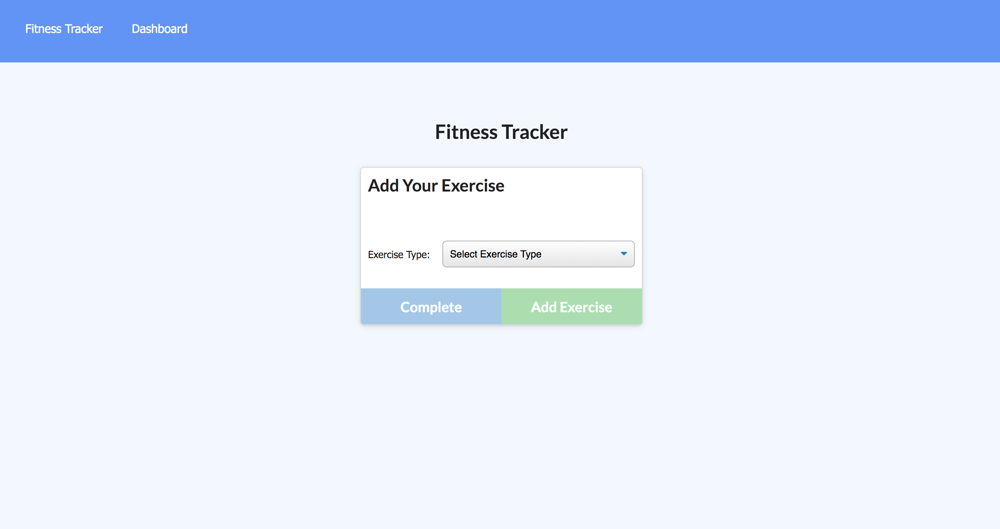
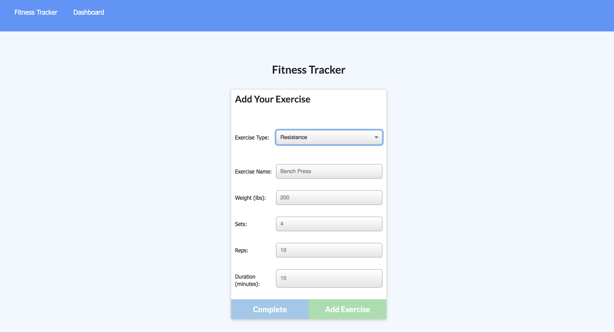
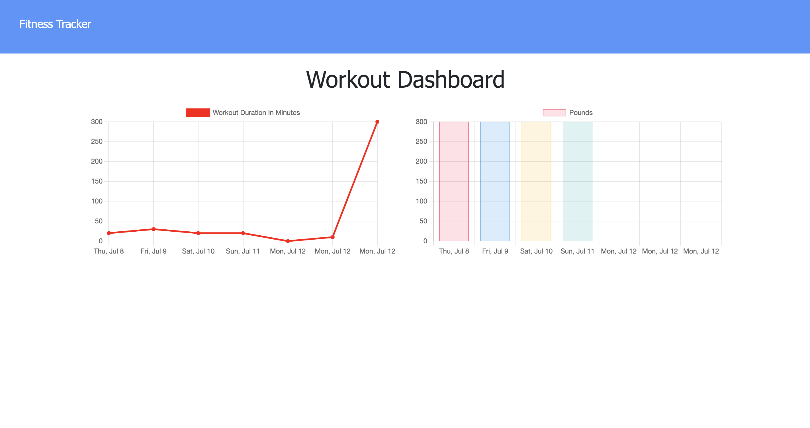

# Fit to Track 

## Deployed application

Application: [Fit to Track]()

## Description
Fit to Track is a dynamic and intuitive workout tracking application. Upon the initial opening of the application the user is allowed to create a new workout. If you are a returning user then you will see data from your last workout displayed on the screen, with the option to continue your workout or start a new session. Once all workouts are added and complete the user can than exam thier progress by going to the stats page. On the stats page the users data is disaggregated by date. There are two graphs on this page, one graph displays the total weight lifted while the other displays the total duration of the workout.


        
## Technologies Used

```
Node.js
NPM
Express.js
MongoDB
Javascript
HTML
CSS
```
## Screenshots






## Questions       
If you have any questions please contact me by email or through my GitHub profile
        
* Email: ashquinngordon@gmail.com
        
## License      
Licensed under the Mozilla Public License 2.0 license. Use the following link for permissions and allowances:
https://opensource.org/licenses/MPL-2.0